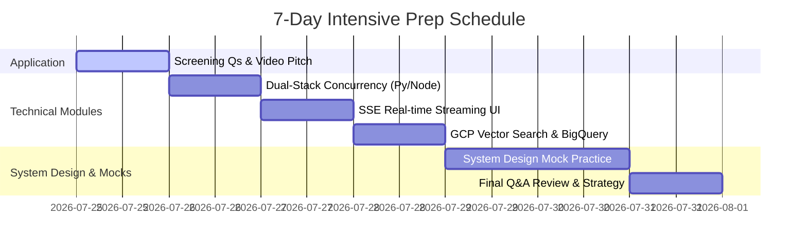

# Aviato Consulting: Senior Fullstack AI Engineer / FDE Interview Preparation Plan

A comprehensive, multi-module interview preparation suite tailored for the **Senior Fullstack AI Engineer / Generative AI Forward Deployed Engineer (FDE)** role at **Aviato Consulting**.

---

## 🎯 Target Role & Profile Overview

* **Company:** Aviato Consulting (Google Cloud Platform Premier Partner, ex-Googler leadership)
* **Title:** Senior Fullstack AI Engineer / Generative AI Forward Deployed Engineer (FDE)
* **Work Model:** 100% Remote (India)
* **Core Competencies Evaluated:**
  1. **AI-Native Software Engineering & Context Scoping:** Mastering tools like AntiGravity, Claude Code, Cursor with modular context architecture (`skills.md`, `.agents/AGENTS.md`).
  2. **Dual-Stack Backend Mastery:** Python (FastAPI/Django async concurrency) + Node.js (V8 Event Loop, Streaming APIs).
  3. **Real-time SSE Frontend & Streaming UIs:** Next.js, React, Tailwind CSS, Server-Sent Events for token streaming.
  4. **GCP LLMOps & Big Data:** Vertex AI Vector Search, BigQuery, GCP Dataflow (Apache Beam), pgvector/ChromaDB/Pinecone.
  5. **FDE Mindset:** Translating client AI prototypes into enterprise production systems.

---

## 📂 Preparation Suite Modules

| Module | Document | Description |
| :--- | :--- | :--- |
| **01** | [Screening Questions Playbook](./01-screening-questions-playbook.md) | Word-for-word strategies for screening prompts (AI context management, video pitch, CTC). |
| **02** | [System Design: Real-time SSE Streaming](./02-system-design-sse-streaming.md) | Architectural blueprint for low-latency LLM streaming using FastAPI/Node.js & Next.js. |
| **03** | [System Design: GCP Vector & Memory Pipeline](./03-system-design-vector-memory-gcp.md) | Production RAG & long-term memory architecture utilizing BigQuery, Dataflow, and Vertex AI Vector Search. |
| **04** | [Dual-Stack Backend Mastery](./04-backend-dual-stack-mastery.md) | Deep dive into Python `asyncio` & Node.js event loop mechanics, streams, and REST/gRPC APIs. |
| **05** | [Technical Question Bank & Answers](./05-mock-interview-questions-bank.md) | Targeted interview questions with complete solutions covering LLMOps, Cloud Data, and FDE scenarios. |
| **06** | [Adaptive Frontend Architecture](./06-frontend-adaptive-ui-nextjs.md) | Next.js App Router, React Server/Client Components, Tailwind CSS, and SSE Streaming hooks. |
| **07** | [Cloud Data Architecture (Dataflow & BigQuery)](./07-cloud-dataflow-bigquery-pipelines.md) | BigQuery partitioning/clustering, Apache Beam streaming in Dataflow, and Storage Write API. |
| **08** | [LLMOps & Vertex AI Vector Search](./08-llmops-vertexai-vectordb-deepdive.md) | Vertex AI endpoint deployment, ScaNN vs HNSW indexing, and Vector DB comparison (pgvector, Pinecone, Chroma). |
| **09** | [Enterprise DevOps & Data Validation](./09-devops-multicloud-data-validation.md) | Docker containerization, Cloud Run / Cloud Functions, CI/CD Cloud Build, and Pydantic V2 / Zod schemas. |

---

## 📅 Suggested 7-Day Study & Practice Schedule

---

## 🚀 Key Checklist Before Interviews
- [ ] Finalized response for Screening Question 1 (AI context management protocol).
- [ ] Practice 2-minute video pitch ("What makes you fit for the role?").
- [ ] Diagrams drawn for SSE streaming architecture & Vertex AI hybrid search pipeline.
- [ ] Reviewed Node.js event loop phases vs Python `asyncio` event loops.
