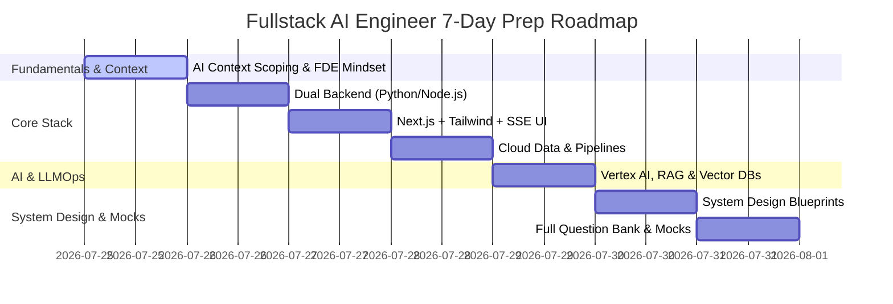

# Fullstack AI Engineer & Forward Deployed Engineer (FDE) Interview Prep Guide

A comprehensive, industry-standard interview preparation guide for **Fullstack AI Engineer** and **Generative AI Forward Deployed Engineer (FDE)** roles across top tech companies, startups, and AI solutions firms.

---

## 🎯 Target Role & Core Skill Matrix

A **Fullstack AI Engineer / FDE** bridges the gap between frontier AI research, production backend infrastructure, real-time data pipelines, and fluid interactive frontend UIs.

```
                           ┌────────────────────────────────────────┐
                           │   Fullstack AI / FDE Core Pillars      │
                           └───────────────────┬────────────────────┘
                                               │
        ┌───────────────────┬──────────────────┼──────────────────┬──────────────────┐
        ▼                   ▼                  ▼                  ▼                  ▼
┌──────────────┐   ┌────────────────┐  ┌──────────────┐  ┌────────────────┐  ┌──────────────┐
│  AI-Native   │   │  Dual Backend  │  │ Real-Time UI │  │ Cloud Data &   │  │  LLMOps &    │
│ Engineering  │   │  Py / Node.js  │  │ Next.js/SSE  │  │ Dataflow/BQ    │  │ Vector DBs   │
└──────────────┘   └────────────────┘  └──────────────┘  └────────────────┘  └──────────────┘
```

---

## 📂 Curriculum & Preparation Modules

| Module | Document | Description |
| :--- | :--- | :--- |
| **01** | [FDE Playbook & Screening](./01-screening-and-fde-playbook.md) | Forward Deployed Engineer mindset, AI CLI context scoping (`skills.md`, `.agents/AGENTS.md`), token efficiency, and interview screening prompts. |
| **02** | [System Design: SSE Token Streaming](./02-system-design-sse-streaming.md) | Architectural blueprint for low-latency LLM token streaming with FastAPI/Node.js backends and Next.js/React frontends. |
| **03** | [System Design: RAG & Vector Memory](./03-system-design-vector-rag-memory.md) | Enterprise RAG pipelines, Hybrid Search (Dense + Sparse), Chunking, and Long-Term Agentic Memory architectures. |
| **04** | [Dual-Stack Backend Mastery](./04-backend-dual-stack-python-nodejs.md) | Python (`asyncio`, FastAPI, ProcessPools, GIL) vs Node.js (V8 Isolate, `libuv` Event Loop, Transform Streams). |
| **05** | [Adaptive Frontend Architecture](./05-frontend-adaptive-ui-nextjs.md) | Next.js App Router, React Server/Client Components, Tailwind CSS, SSE custom hooks, and dynamic AI component rendering. |
| **06** | [Cloud Data Engineering Pipelines](./06-cloud-data-pipelines-bigquery-dataflow.md) | BigQuery partitioning/clustering, GCP Dataflow & Apache Beam streaming/batch pipelines, and Storage Write API. |
| **07** | [LLMOps & Vector Infrastructure](./07-llmops-vertexai-vectordbs.md) | Vertex AI endpoint hosting, Fine-tuning vs RAG, HNSW vs ScaNN algorithms, and Vector DB comparison (pgvector, Pinecone, ChromaDB). |
| **08** | [Enterprise DevOps & Data Validation](./08-devops-multicloud-data-validation.md) | Docker containerization, Cloud Run, Cloud Functions, CI/CD pipelines (Cloud Build / GitHub Actions), and Pydantic V2 / Zod schemas. |
| **09** | [Comprehensive Mock Question Bank](./09-mock-interview-question-bank.md) | 30+ technical interview questions with complete solutions covering all fullstack AI engineering domains. |

---

## 📅 7-Day Interview Preparation Schedule


